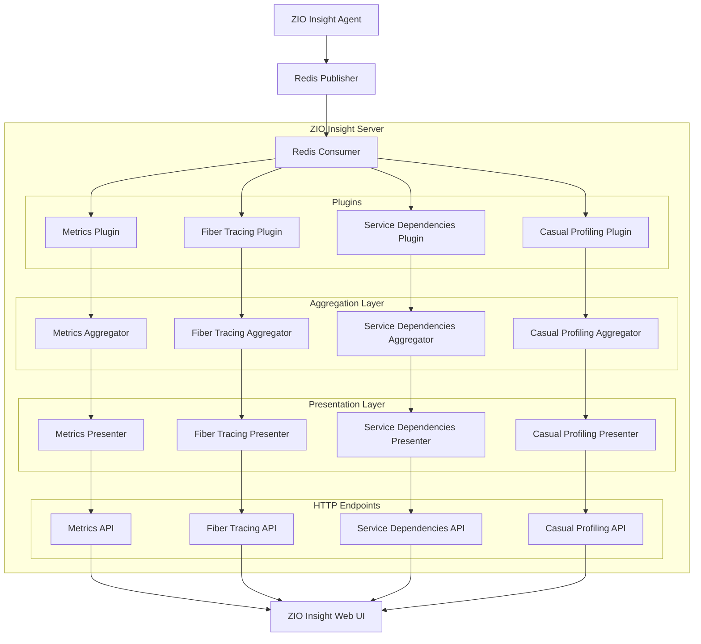

```mermaid
graph TD

Agent["ZIO Insight Agent"]
Redis["Redis Publisher"]
UI["ZIO Insight Web UI"]

Agent --> Redis
Redis --> RedisConsumer

subgraph "ZIO Insight Server"
RedisConsumer["Redis Consumer"]

    subgraph "Plugins"
      Metrics["Metrics Plugin"]
      FiberTracing["Fiber Tracing Plugin"]
      ServiceDependencies["Service Dependencies Plugin"]
      CasualProfiling["Casual Profiling Plugin"]
    end

    subgraph "Aggregation Layer"
      AggMetrics["Metrics Aggregator"]
      AggFiberTracing["Fiber Tracing Aggregator"]
      AggServiceDependencies["Service Dependencies Aggregator"]
      AggCasualProfiling["Casual Profiling Aggregator"]
    end

    subgraph "Presentation Layer"
      PresMetrics["Metrics Presenter"]
      PresFiberTracing["Fiber Tracing Presenter"]
      PresServiceDependencies["Service Dependencies Presenter"]
      PresCasualProfiling["Casual Profiling Presenter"]
    end

    subgraph "HTTP Endpoints"
      EP_Metrics["Metrics API"]
      EP_FiberTracing["Fiber Tracing API"]
      EP_ServiceDependencies["Service Dependencies API"]
      EP_CasualProfiling["Casual Profiling API"]
    end

end

RedisConsumer --> Metrics
RedisConsumer --> FiberTracing
RedisConsumer --> ServiceDependencies
RedisConsumer --> CasualProfiling

Metrics --> AggMetrics
FiberTracing --> AggFiberTracing
ServiceDependencies --> AggServiceDependencies
CasualProfiling --> AggCasualProfiling

AggMetrics --> PresMetrics
AggFiberTracing --> PresFiberTracing
AggServiceDependencies --> PresServiceDependencies
AggCasualProfiling --> PresCasualProfiling

PresMetrics --> EP_Metrics
PresFiberTracing --> EP_FiberTracing
PresServiceDependencies --> EP_ServiceDependencies
PresCasualProfiling --> EP_CasualProfiling

EP_Metrics --> UI
EP_FiberTracing --> UI
EP_ServiceDependencies --> UI
EP_CasualProfiling --> UI
```
